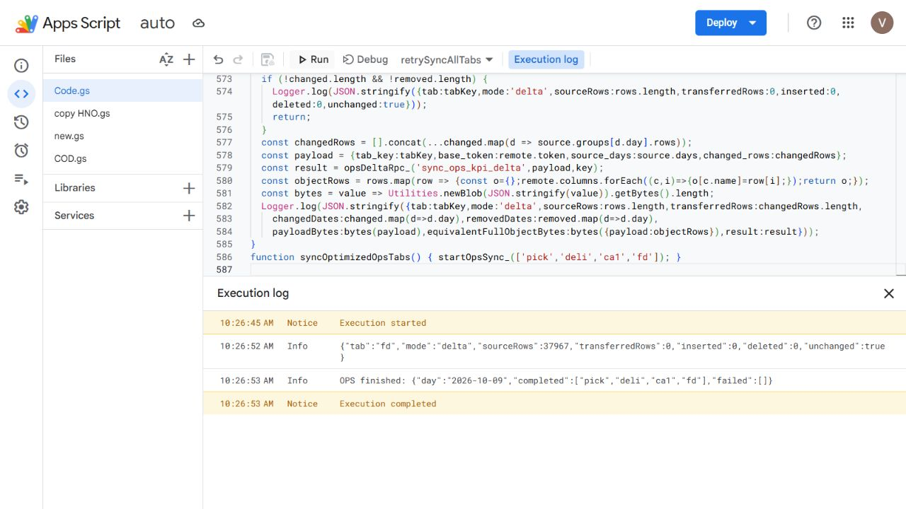

# OPS Sheet → Supabase incremental sync

Applied to the `auto` Apps Script project on 2026-10-09. Scope: Pick, Deli,
CA1 and FD. BI queries and Leadtime remain unchanged.

## Quyết định đã chốt trong cuộc trao đổi

- Chỉ tối ưu truyền/ghi dữ liệu Sheet → Supabase. Không sửa datajob BI hay tối
  ưu lượng dữ liệu BI quét. Tối ưu Leadtime pending; daily sync Leadtime vẫn chạy.
- Không chỉ append D-1: Pick/Deli/CA1 còn có thể được sửa bởi dữ liệu về muộn;
  FD thay đổi tử theo thời gian và query hiện xuất D-22..D-8, không xuất D-1.
  Benchmark rolling cũng có thể đổi trên dòng cũ. So sánh toàn bộ cửa sổ hiện
  có và gửi ngày mới/thay đổi giúp giữ đúng các hành vi này.
- Giữ một project Apps Script auto. Queue KPI chạy từng tab riêng; COD và copy
  HNO/SPB giữ handler/trigger riêng. Chia file giúp quản lý; chưa tách project
  hoặc giãn lịch. Nếu quota tiếp tục lỗi, xem xét giãn lịch trước; không giả
  định nhiều project cùng tài khoản sẽ tăng quota.
- Luồng raw → HCM bỏ dedup/history là quyết định riêng, xem
  [raw-hcm-sync.md](raw-hcm-sync.md). Không áp dụng giả định raw chỉ chứa đơn mới
  sang query KPI. Query Leadtime chưa được đánh giá trong phiên này.

## Behavior

The script reads the complete current Sheet window, normalizes typed columns,
and compares an order-independent per-day fingerprint with Supabase. It sends
only changed/new days in column arrays, plus a small manifest of the complete
source window. Unchanged runs transfer zero data rows and perform zero writes.
Benchmark columns remain part of the comparison, so a benchmark change can
cause an older date to be sent even if its KPI numerator/denominator is stable.

The SQL RPC matches identical rows with occurrence numbers to preserve duplicate
multiplicity. It keeps existing IDs for matching rows, deletes obsolete rows,
and inserts new/changed rows atomically. Dates leaving the source window are
removed, preserving existing dashboard retention. The maximum-ID `synced_at`
boundary advances on mutation to preserve the existing dashboard pagination
race check, including changes that only remove an older date.

Source guards require a nonempty valid dataset within D-14..D-1 (Pick/Deli/CA1)
or D-22..D-8 (FD), with the newest expected date present. They do not prove the
BI batch is complete: the upstream source still must finish refreshing before
sync. A day with zero rows is represented by absence from the complete window.

## Retry and concurrency

The existing durable queue remains responsible for one tab per execution,
locking, watchdog recovery and bounded retries. Each retry reads the remote
manifest again. A changed remote token returns SQLSTATE 40001; a lost HTTP
response after a successful commit becomes a no-op on retry. Payload hashes
and row counts are checked before mutation and after mutation; mismatch rolls
back the whole transaction. New RPCs are executable only by service_role.

## Files and recovery

- `scripts/sql/ops-kpi-incremental-sync.sql`: additive RPC definitions.
- `scripts/apps-script/ops-incremental-sync.gs`: helpers added to live Code.gs.
- `scripts/apps-script/ops-sync-live-20261009.gs`: complete saved live Code.gs,
  including the existing queue and Leadtime branch; other project files are separate.
- `scripts/apps-script/ops-incremental-sync.test.mjs`: Postgres/PGlite checks.

Integration: `syncOneTab` delegates Pick/Deli/CA1/FD to `syncOpsDeltaTab_` before
the existing full-refresh branch. `syncOptimizedOpsTabs` checks these four tabs
through the existing queue. Daily `syncAllTabs` retains the existing five-tab
schedule; Leadtime continues its old sync behavior while optimization is pending.

Rollback to the previous behavior: remove the four-tab delegation in
`syncOneTab`. Legacy RPCs are retained. Do not reset queue state during an active
execution. No service key is stored in this repository.

## Validation

Run `node scripts/apps-script/ops-incremental-sync.test.mjs`. Tests cover
duplicate multiplicity, row order, unchanged IDs, response-loss retry, changed
row replacement, older-date removal, snapshot boundary, stale tokens, payload
rollback, missing wh_id, midnight timestamp strings, source windows, and rejection
of Leadtime. Live RPC no-op checks confirmed all four existing snapshots retain
their row counts. A live CA1 single-row mutation test was rolled back.

The final live validation job completed at 10:26:53 ICT on 2026-10-09 with
Pick/Deli/CA1/FD completed and no failed tabs. Counts remained 28,739 / 30,143 /
1,231 / 37,967. Retry triggers were cleared; three original daily triggers remain.
There are 28 local assertions and 16 existing dashboard-reader tests passing.

The counts, runtime evidence and trigger inventory above are the observed
2026-10-09 snapshot, not a guarantee of subsequent source completeness or
savings on future days. Unchanged runs still read the Sheet and exchange the
small manifest; zero transferred rows does not mean zero network traffic.

Repository handover validation: `npm test` passed 547 tests, including the new
sync test file (30 assertions plus the saved script's 16 retry checks).
`npm run build` and changed-test lint passed. This repository validation does
not reapply SQL, update Apps Script, or prove a later deployment.
