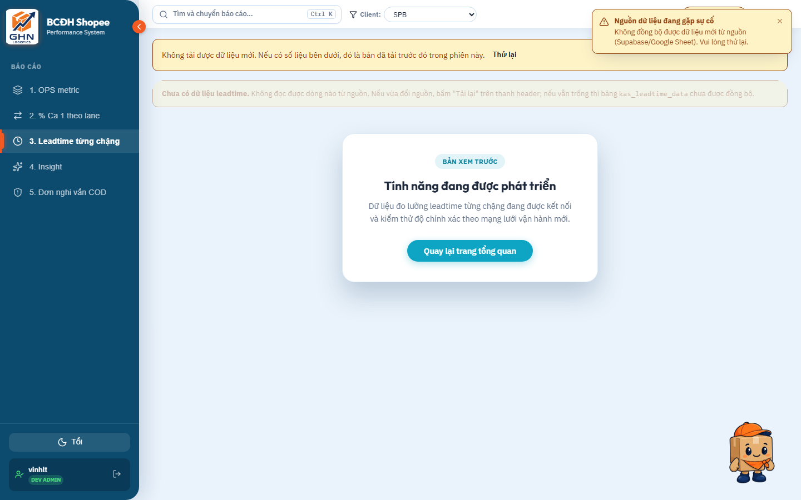
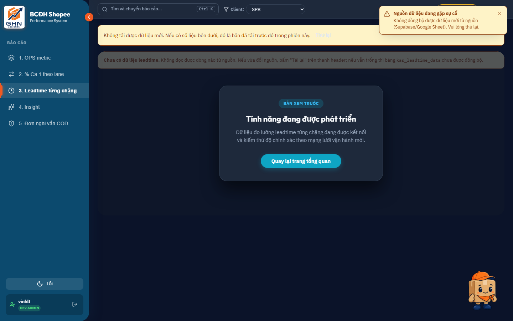
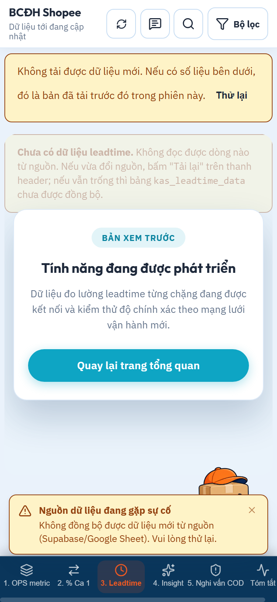
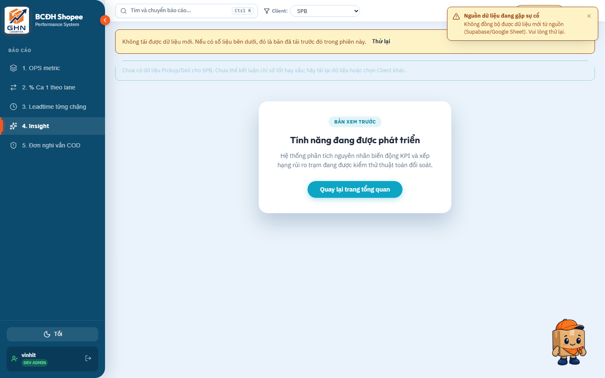
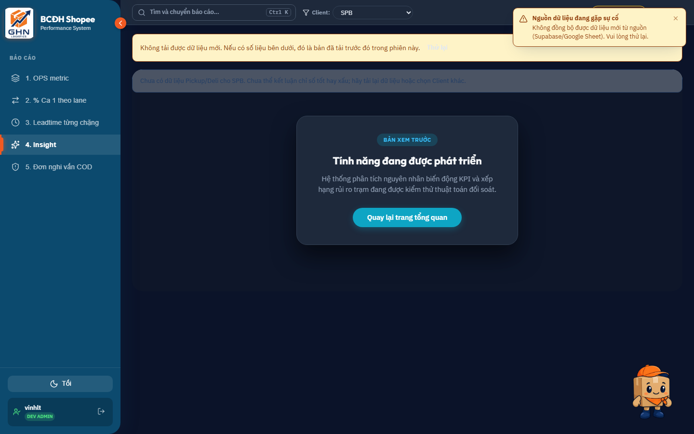
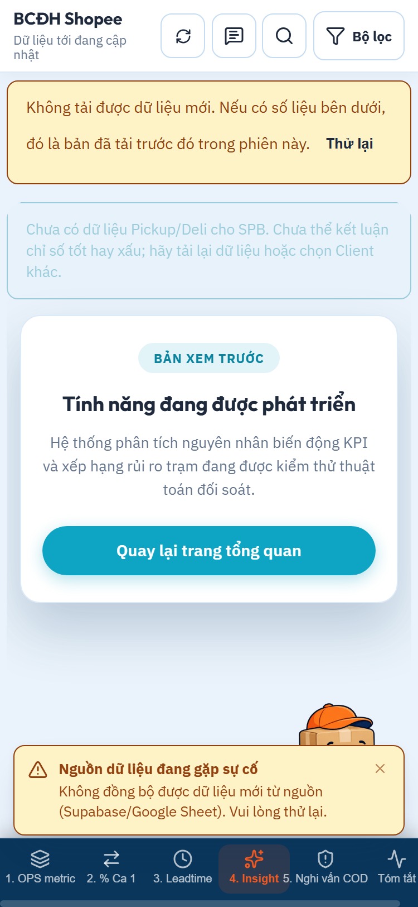
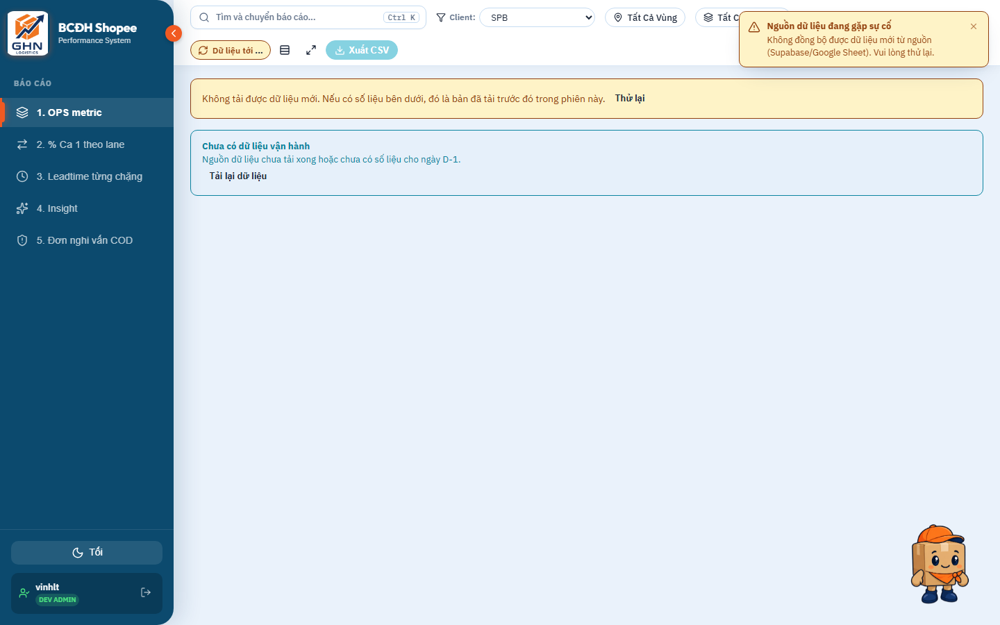

# Tổng kết & Chứng cứ Kiểm thử UI Màn phủ "Đang phát triển" (Tab 3 & Tab 4)

Dưới đây là toàn bộ kết quả kiểm thử trực quan và xác minh tương tác trên trình duyệt thực tế (Microsoft Edge headless via CDP) đối với **Tab 3** (`report3`) và **Tab 4** (`report-insight`) ở cả 3 chế độ: **Desktop Light Mode**, **Desktop Dark Mode**, và **Mobile Viewport (375 × 812)**.

---

## 1. Bằng chứng kiểm tra trực quan (Visual Verification Evidence)

````carousel

<!-- slide -->

<!-- slide -->

<!-- slide -->

<!-- slide -->

<!-- slide -->

<!-- slide -->

````

---

## 2. Kết quả kiểm tra chức năng & Bảo vệ lớp nền

Dựa trên kết quả đo đạc trực tiếp từ DOM của trình duyệt:

| Tiêu chí kiểm tra | Kết quả ghi nhận | Trạng thái |
| :--- | :--- | :---: |
| **Tiêu đề Tab 3** | `"Tính năng đang được phát triển"` | **PASS** |
| **Mô tả Tab 3** | *"Dữ liệu đo lường leadtime từng chặng đang được kết nối và kiểm thử độ chính xác theo mạng lưới vận hành mới."* | **PASS** |
| **Tiêu đề Tab 4** | `"Tính năng đang được phát triển"` | **PASS** |
| **Mô tả Tab 4** | *"Hệ thống phân tích nguyên nhân biến động KPI và xếp hạng rủi ro trạm đang được kiểm thử thuật toán đối soát."* | **PASS** |
| **Click nút CTA** | Gọi `onBackToOverview()` $\rightarrow$ Active tab trên Sidebar chuyển thành **`1. OPS metric`** | **PASS** |
| **Khóa tương tác chuột nền** | `pointer-events: none !important; user-select: none !important;` trên `.dev-overlay-content` | **PASS** |
| **Khóa tương tác bàn phím nền** | `inert="true"`, `aria-hidden="true"`, `couldFocusUnderlying: false` | **PASS** |
| **Chế độ Tối (Dark Mode)** | Thẻ nền `#1e293b`, viền `#334155`, chữ `#f8fafc`, lớp phủ mờ tối `rgba(15, 23, 42, 0.72)` | **PASS** |
| **Giao diện Di động (Mobile)** | Nút bấm tự động dãn full-width đạt chuẩn $\ge 44\text{px}$, không che thanh đáy `mobile-bottom-nav` | **PASS** |

---

## 3. Thống kê Git (`git diff --stat`)

```text
 src/App.jsx   |  47 ++++++++------
 src/index.css | 197 ++++++++++++++++++++++++++++++++++++++++++++++++++++++++++
 2 files changed, 226 insertions(+), 18 deletions(-)
```

### Danh sách file thay đổi:
- **`src/App.jsx`** *(modified)*: Import và bọc `ReportLeadtime` & `ReportInsight` bằng `UnderDevelopmentOverlay`.
- **`src/index.css`** *(modified)*: Thêm các class CSS `.dev-overlay-...`, hỗ trợ dark mode và mobile responsive.
- **`src/components/ui/UnderDevelopmentOverlay.jsx`** *(untracked/new)*: Component lớp phủ tái sử dụng.

> [!NOTE]
> Mọi thay đổi hiện vẫn được **giữ nguyên ở trạng thái uncommitted**, không commit, không push, không tạo PR.

---

## 4. Kết quả Build & Test tự động

- **Vite Build**:
  ```powershell
  npx vite build
  # Output: ✓ built in 1.34s (dist/assets/index-*.js, dist/assets/index-*.css) - 0 errors
  ```
- **Unit Tests**:
  ```powershell
  node --test src/utils/*.test.mjs
  # Output: ℹ tests 93, ℹ pass 93, ℹ fail 0 (100% PASS)
  ```
